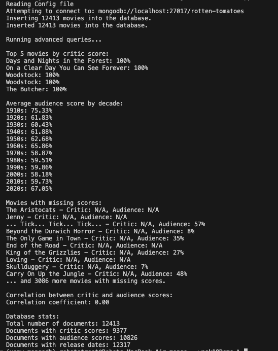

# MongoDB Movie Database Project


## Table of Contents
1. [Overview](#project_overview)
2. [Project Files](#project_files)
3. [Executing Program](#how_to_run)
4. [Terminal Output](#output)
5. [Steps](#steps)
6. [Acknowledgement](#acknowledgement)

## Project Overview
This project demonstrates the use of MongoDB with Python to manage and analyze movie data. It includes functionality to import movie information from CSV and JSON files, perform various database operations, and execute advanced queries using MongoDB's aggregation framework.

## Project Files
- `mongo-project.py`: Main script to run the project
- `mongo-project.conf`: Configuration file for database connection
- `modules/db.py`: Database connection and configuration handling
- `modules/movies.py`: Movie-related operations and queries
- `modules/csv_util.py`: Utility for reading CSV files
- `modules/json_util.py`: Utility for reading JSON files
- `data/movie_info.csv`: Sample movie data in CSV format
- `data/movie_info.json`: Sample movie data in JSON format

## How to Run
1. Ensure you have MongoDB installed and running on your system. 
(You can use brew services to download mongodb, and after the activation; use `mongosh` code in your terminal to run mongodb shell.)
2. Install the required dependencies:
   ```
   pip install -r requirements.txt
   ```
    or if you would like to install it manually;
   ```
   pip install pymongo configparser
   ```

3. Clone this repository to your local machine.
4. Navigate to the project directory.
5. Run the main script:

   ```
   python mongo-project.py
   ```

<a name="output"></a>

## Queries and Terminal Output



## Steps
1. The script reads the configuration file (`mongo-project.conf`).
2. It establishes a connection to the MongoDB database.
3. Movie data is read from CSV and JSON files.
4. The data is inserted into the MongoDB collection.
5. Various queries are executed to demonstrate MongoDB operations and aggregations.

## Acknowledgements
- Special thanks to Prof. Rahim Virani for teaching the configuration and general structure of the process during my education at Douglas College. 
- This project uses the `pymongo` library to interact with MongoDB.
- Sample movie data is sourced from Rotten Tomatoes (for educational purposes only).